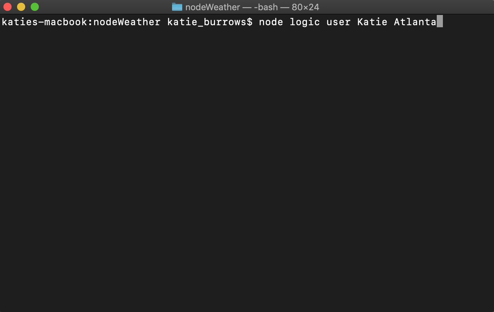

                                                 Node Weather 

Using the CLI, the user is able to use the program as either the user or the administrator.  The user will start the file in node and then type in "user", their name, and the location they are looking for weather data on.  This search will be written into a .txt file that also logs the date that they made this query.  The query will be used to look up the weather for the location specified using the weather-js npm package.  Once the query is made the data will come back to the CLI in the form of a console.log. An admin will start the program in node and type "admin" which will then pull data from a .txt file.  That data (user's name, location that was searched, and the day that they searched on) will be displayed in a console.log to the CLI.

Although this is not the most practical/optimal way to use constructors/module.exports it is an example of how they can be used. The construction begins at __userConstructor.js__ and feeds into __adminConstructor.js__ with everything threading together in __logic.js__.

### Built With:
* JavaScript
* Node 
* fs NPM
* Moment NPM
* Weather-js NPM
* Constructors

### Developed by Katie Burrows
